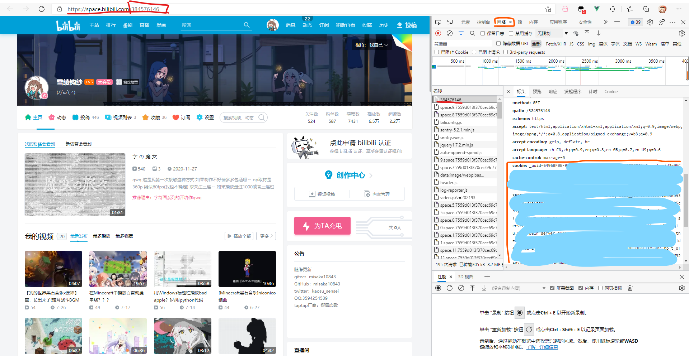

# bilibili-manga-download

bilibili漫画下载器（支持输出json索引）


## 目录

[toc]

## 简介

这个仓库是根据[@xuruoyu](https://github.com/xuruoyu/)的[这个仓库](https://github.com/xuruoyu/bilibili_manga_downloader/)进行改编

从而支持直接输入cookie并且存储cookie、输出json索引、自定义下载路径

可以理解成优化用户体验吧qwq

输出的json可以供 *服务器* 使用（PHP或者其他网页语言可直接解析）

## 使用

本程序使用方式有两种，包括 *直接使用* 以及 *编译使用*

其中， *直接使用* 适合 *小白* ，而 *编译使用* 适合要 *自定义内容* 的 *知道python* 的大佬

### 直接使用

请直接下载`dist`文件夹下的`bilibili漫画下载.exe`即可

### 编译使用

如果需要修改或者自定义什么可以下载`index_decode.py`以及`manga.py`并允许`manga.py`即可

如果需要编译成程序可以输入这个指令

`pyinstaller -i ico.ico -F manga.py -n bilibili漫画下载`

（注意，如果第一次用请先运行这个`pip install pyinstaller`）

其中，`-i ico.ico`是设置本程序的图标，`-n bilibili漫画下载`是设置程序的名称，具体用法可以搜索`pyinstaller`参数

## cookie获取

1.打开您的个人空间（如果您的链接不是`space.bilibili.com/10843`这种的话，建议 **删除您uid后的所有url**）

2.打开`F12`（有些电脑需要`Fn+F12`）

3.重新刷新后在网络选项中找到与您 **uid一样** 的一个文件

4.点击后在`标头`中找到`cookie`字段

5.直接复制`cookie`字段中的全部内容即可(也就是从 **_uuid** 开始)



## 备注

### 1.开源协议

因为原作者未提供相关开源协议，所以本人选择了一个相对宽松的**GPL协议**

还请遵守此协议！

### 2.python中的json输出问题

因为本人不知道怎么才能更好输出json，所以就直接写入文件了qwq，所以json索引的部分可能比较乱qwq

例如

```python
    with open(download_path+"/"+comictitle+"/chapter.json", "w", encoding='utf-8') as f:
        f.write("[\n")
        while a < len(filelist):
            a = a + 1
            b = a - 1
            files = os.listdir(download_path+"/"+comictitle +
                               "/"+filelist[b])   # 读入文件夹
            filenum = len(os.listdir(download_path+"/" +
                          comictitle+"/"+filelist[b]))
            if a < len(filelist):
                f.write("{\n\"id\":\""+str(b)+"\",\n\"title\":\""+filelist[b]+"\",\n\"url\":\""+download_path +
                        "/"+comictitle+"/"+filelist[b]+"\",\n\"page\":\""+str(filenum)+"\"\n},\n")
            else:
                f.write("{\n\"id\":\""+str(b)+"\",\n\"title\":\""+filelist[b]+"\",\n\"url\":\""+download_path +
                        "/"+comictitle+"/"+filelist[b]+"\",\n\"page\":\""+str(filenum)+"\"\n}\n")
        f.write("]")
```

### 3.json输出格式(json为样例)

#### manga.json(总目录json)

```json
[
    {
        "title":"总之就是非常可爱",
        "id":"1",
        "page":"5"
    },
    {
        "title":"魔女之旅",
        "id":"2",
        "page":"14"
    }
]
```

#### chapter.json(每个漫画的章节json)

```json
[
    {
        "id":"0",
        "title":"1_月光传递着爱的信息",
        "url":"./manga/总之就是非常可爱/1_月光传递着爱的信息",
        "page":"31"
    },
    {
        "id":"1",
        "title":"2_如此这般可喜可贺_可喜可贺",
        "url":"./manga/总之就是非常可爱/2_如此这般可喜可贺_可喜可贺",
        "page":"35"
    },
    {
        "id":"2",
        "title":"3_这件事比跟丘比特签约要简单，但是比成为魔法少女要沉重",
        "url":"./manga/总之就是非常可爱/3_这件事比跟丘比特签约要简单，但是比成为魔法少女要沉重",
        "page":"23"
    },
    {
        "id":"3",
        "title":"4_只有你才能触碰的东西",
        "url":"./manga/总之就是非常可爱/4_只有你才能触碰的东西",
        "page":"17"
    },
    {
        "id":"4",
        "title":"5_阿良良木君曾经说过，全部都喜欢",
        "url":"./manga/总之就是非常可爱/5_阿良良木君曾经说过，全部都喜欢",
        "page":"21"
    },
    {
        "id":"5",
        "title":"贺图__",
        "url":"./manga/总之就是非常可爱/贺图__",
        "page":"1"
    }
]
```

#### 4.json路径

漫画列表路径为`定义下载路径/manga.json`

每个漫画章节的路径为`定义下载路径/漫画名/chapter.json`
